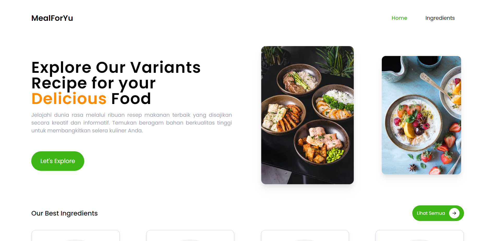
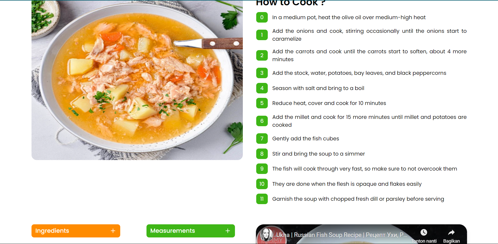

# CMLabs Frontend Fulltime Test

> Simple Website Food Recipe Application using API from [themealdb API](https://themealdb.com).

## Table of Contents

- [Project Image](#project-image)
- [Installation Project](#installation-project)
- [Structure Project](#structure-project)
- [User Instructions](#user-instructions)
- [Features](#features)
- [Technologies Used](#technologies-used)

### Project Image

1. Landing Page



2. Melas Detail Page



### Installation Project

1. Clone this repository.

```bash
git clone https://github.com/rafmasloman/cmlabs-frontend-fulltime-test.git
```

2. Move to application directory.

```bash
cd cmlabs-frontend-fulltime-test
```

3. Install all dependencies.

```bash
# using pnpm
pnpm install

# using yarn
yarn install

# using npm
npm install
```

4. Run application.

```bash
# using pnpm
pnpm dev

# using yarn
yarn dev

# using npm
npm run dev
```

5. Application will be running on port : `http://localhost:3000`.

### Structure Project

**This is your source code tree:**

```
src
|-- assets
   |-- icons
   |-- images
|-- components
   |-- atomic
   |-- molecul
   |-- organism
|-- hooks
|-- interfaces
|-- pages
   |-- ingredients
          |-- detail
            |-- [name].tsx
          |-- index.tsx
   |-- meals
          |-- detail
            |-- [id].tsx

|-- services
|-- styles
|-- utils
...

```

## User Instructions

1. **Ingredients Page**

   - Displays a list of ingredients fetched from the "List of Ingredients" endpoint.
   - When an ingredient is selected, it redirects to the Ingredients Detail page.
   - Includes a feature to search for ingredients by name on the front end.

2. **Ingredients Detail Page**

   - Parameter: `ingredient-name`.
   - Displays a list of meals associated with the selected ingredient, using the "Filter by Ingredients" endpoint.
   - When a meal is selected, it redirects to the Meals Detail page.
   - Includes a feature to search for meals by name on the front end.

3. **Meals Detail Page**
   - Parameter: `meal-id`.
   - Displays detailed information about a selected meal, using the "Detail Meal" endpoint.
   - Includes components: Meal Image, Meal Title/Name, Description/Tutorial, Recipe, and an embedded YouTube video.

## Features

- [x] List Ingredients
- [x] Search Ingredients
- [x] List Meals based on selected Ingredient
- [x] Search Meals
- [x] Meals Detail

## Technologies Used

This project utilizes the following technologies:

- [Next.js](https://nextjs.org/)
- [React](https://reactjs.org/)
- [Tailwind CSS](https://tailwindcss.com/)

```

```
